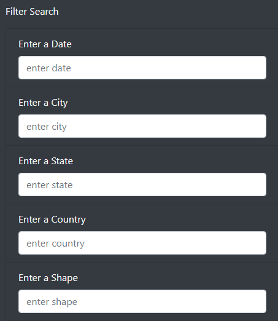
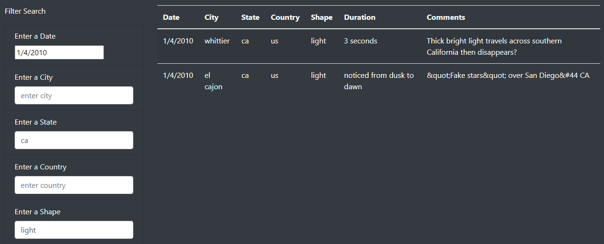

# UFO Sightings Analysis

## Overview of Project
The stakeholder wants to create a dynamic webpage and table that allows users to filter for multiple criteria at the same time. 

## Results
Using Javascript, I created multiple filters that will allow users to limit their results by date, city, state, country, and/or shape. 

The default format of the filters indicates that the user should enter the appropriate text. 

In action, the filters can be used one at a time or together to produce desired results. 

## Summary
While the final webpage is dynamic and provides the desired filters, there are some issues that could be rectified with additional development. 

- The first issue is with formatting. It may not be evident to users that city, state, and country names must be entered in lowercase in order to return any values since that's the format of the data. Using the toLowerCase method should ensure that any case that the user implements is converted appropriately to lower case. 
- The second, similar issue is with date formatting. Including dateControl in the code could prevent confusion for those who use a different date format. 